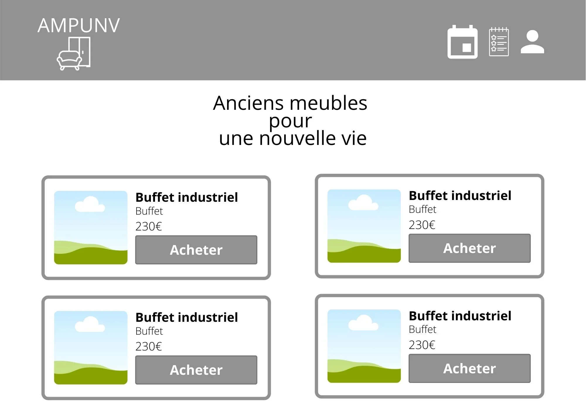

# ENONCE EXERCICE

## Contexte

Formation Ada Tech School - projet pour travailler le back et le front - 8 jours de travail effectif - Conception d'une plateforme de vente de meubles en ligne. Ce README est l'énoncé de l'exercice.

Une plateforme de gestion d’un magasin de meubles est souvent un site web, sur lequel des utilisateurs s’inscrivent et interagissent avec le stock. Il y a différents types d’utilisateurs qui par conséquent ont des droits différents.

### Notions abordées
- Déploiement web
- Bases de données
- Interactions Front-end/Back-end
- Utilisation d’un framework pour le back-end
- Sécurisation des mots de passe

## Enoncé

Lauréline Fleury a lancé son entreprise “Anciens meubles pour une nouvelle vie”, de vente de meubles de seconde main. Pour gagner en visibilité, elle a besoin d’avoir un site internet pour afficher ses produits. En plus, cela lui permettra de gérer son stock.

### Besoin de Lauréline

🌱 **Point de vigilance d’éco-conception**

De manière générale, il convient d’interroger et prioriser les besoins de vos clients en début de projet. Mettez de côté les fonctionnalités les moins utiles, pour vous concentrer sur l’essentiel. Cela se rapproche, finalement, de ce qu'on attend dans les bases de l'UX (expérience utilisateur) Design.

> « J’ai besoin d’avoir une page principale qui regroupera les meubles en vente en ce moment. Pour l’affichage de chaque meuble, je souhaite un encart dans lequel on pourra retrouver une photo, le type de meuble, le prix et un bouton pour l’acheter.

🔍 **Point de vigilance d’accessibilité**

Pour chaque image de décoration, il faudra renseigner une alternative d’image vide. Vous pouvez vous référer au critère 1.2 du RGAA. Si sur vos images vous n’avez que le meuble, sans texte alors c’est une image de décoration. Car toutes les informations concernant votre meuble seront dans la description et seront donc compréhensibles par l’ensemble de vos utilisatrices et utilisateurs.

> Chaque encart sera cliquable pour permettre d’accéder au détail du produit. Sur cette nouvelle page, on retrouvera une série de photos du meuble et toutes les informations nécessaires, c’est-à-dire, le type, le prix, les dimensions, les couleurs, les matières et bien sûr un bouton pour acheter.

🔍 **Point de vigilance d’accessibilité**

Les encarts cliquables devront être des liens, avec la balise `<a href>`. Les boutons servent à soumettre des formulaires ou à actionner des interactions gérées via JavaScript. En revanche, les boutons ne servent pas à aller sur une autre page web (ou à une zone de la page web en cours de consultation) ; ça, ce sont les liens qui le font.

Vous pouvez vous référer au critère 6.1 du RGAA pour valider l’implémentation correcte d’un lien.

🌱 **Point de vigilance d’éco-conception**

On limitera le nombre de photos associées à chaque meuble. Le poids des images peut considérablement ralentir le chargement d’une page web et surcharger inutilement une application. Il est de plus recommandé d’optimiser leur taille au chargement de celles-ci dans votre site.

> Pour ce qui est de l’administration, je souhaite une page de connexion. Lorsque je suis connectée je dois pouvoir accéder à une page de gestion des produits. Sur celle-ci je veux pouvoir avoir la liste de mes meubles. Je souhaite pouvoir modifier les informations de mes produits en ayant un bouton depuis ma liste. Je dois pouvoir également les supprimer s’ils ont été vendus en magasin.

🔍 **Point de vigilance d’accessibilité**

Une liste devra être définie soit de façon ordonnée avec les balises `<ol>` et `<li>` soit de façon non ordonnée avec les balises `<ul>` et `<li>`. Les listes sont contrôlées dans le RGAA par le critère 9.3.

> Les utilisateurs pourront également créer un compte (email + mot de passe) afin de rentrer des types de meubles recherchés. L’affichage de la page principale s’adapterait en fonction de leurs besoins. Si un meuble correspond à son envie, il le retrouvera en premier sur la page.

> Pour aller plus loin, je souhaiterais avoir une page qui permet aux utilisateurs connectés de proposer des meubles à vendre. Je serai la seule qui pourrait voir ces meubles. Je pourrai les valider avant de pouvoir les proposer à la vente, ce, depuis ma page de gestion de produits. Peut-être qu’un statut pour chaque meuble me permettrait de voir ça plus facilement. »

🔐 **Point de vigilance de conformité au RGPD**

Comme dans le projet Réseau Social, vous recueillerez le consentement de vos utilisateurices pour la collecte et la réutilisation de leurs données dans le cadre du service proposé par Lauréline. Vous leur permettrez également de supprimer leur compte, et l’ensemble des produits qui y sont reliés, à tout moment.

### Maquettes

Si vous n’avez pas fait l’exercice individuel de la semaine dernière ou si vous cherchez juste un peu plus d’inspiration, voici des maquettes pour vous aider. Elles sont très sommaires et non exhaustives mais cela peut vous donner une base.

- **Page d'accueil :**  

- **Détail d’un produit :**  

- **Page de gestion des produits :**  

🔍 **Point de vigilance d’accessibilité**

Lors des projets précédents, vous avez pu vous initier aux bonnes pratiques des contrastes de couleurs, des alternatives d’images ainsi que des bonnes pratiques de création de formulaire. À vous de les implémenter correctement pour ce projet pour rendre un web plus accessible à toustes.

🌱 **Points de vigilance d’éco-conception**

Il faut garder à l'esprit que plus un site éco-conçu est léger, moins il consomme.

De manière générale, on recherchera un design épuré.

Lorsque cela est possible, privilégiez les icônes aux images pour vos éléments graphiques.

Veillez aussi à utiliser deux polices d’écriture maximum : une pour les titres et une autre pour le texte. Le chargement de ces dernières nécessite en effet des ressources, donc de l’énergie supplémentaire.

## Organisation des équipes

Pour mener à bien ce projet, trois étapes préliminaires vont être nécessaires :

1. **Conception de la base de données :** Nous allons avoir besoin de nous mettre d’accord sur des données communes, et donc une architecture de ces données, que nous manipulerons à travers l’application.
2. **Points d’API :** Nous allons discuter des points d’API qui seront partagées entre l’équipe front et l’équipe back, pour faire en sorte que chaque équipe puisse avancer sans attendre l’autre équipe.
3. **Répartition des tâches :** Enfin, nous allons discuter pour déterminer qui se lancera côté back, et qui se lancera côté front, pour la première semaine de la séquence.

Puis, quand chaque équipe sera constituée, une discussion aura lieu dans chacune d’elles pour :

- Découper les différentes fonctionnalités en tâches de développement
- Prioriser les tâches
- Distribuer en fonction des envies et possibilités les différentes tâches

Lauréline souhaite voir l’état d’avancement de son projet à mi-parcours. Il faudra donc avoir une démo présentable des premières fonctionnalités. La priorisation est primordiale.

🧽 **Pour anticiper la passation entre les deux équipes**, nous vous recommandons de porter une attention particulière à la documentation du code et d’avoir une nomenclature commune. Il peut être aussi utile de s’accorder sur certains outils comme Postman pour vos APIs.